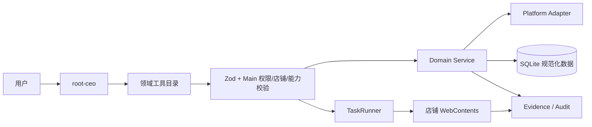

# ShopPilot 单 Agent 电商运营能力开发文档

> 版本：v1.0（2026-10-01）  
> 状态：`M1 IMPLEMENTED / PARTIAL`；`M2 INVENTORY/SKU IMPLEMENTED / PARTIAL`；`M3 ORDER/LIFECYCLE IMPLEMENTED / PARTIAL`；`M4 LOCAL INSIGHT IMPLEMENTED / PARTIAL`；`M5 LOCAL CONTENT/GROWTH IMPLEMENTED / PARTIAL`；代码实现按本文档的 M1 → M6 顺序推进
> 运行时：唯一执行主体 `root-ceo`  
> 发布边界：继续保持 `INTERNAL_BUILD`，没有真实店铺、真实提交和 Windows 桌面验收证据的能力不得标记为 `VERIFIED`。

## 1. 目标和完成定义

ShopPilot 的目标是让一个 `root-ceo` Agent 在店铺浏览器、平台适配器、任务引擎和人工确认边界内完成电商运营闭环：

```text
店铺/会话
  → 商品与素材
  → 库存、价格、SKU
  → 商品发布
  → 订单、发货、物流
  → 售后、退款、客服
  → 经营数据、财务、发票
  → 内容、达人、广告、优惠券
  → 计划任务、失败恢复、审计和复盘
```

“全部能力”只有在以下条件同时满足时才成立：

1. Agent 工具目录有明确的领域动作和 Zod 输入契约。
2. Main 有平台能力检查、店铺隔离、幂等键、状态机和审计记录。
3. 读操作有结构化结果和证据；写操作有人工确认、回读和失败恢复。
4. 每个平台都有真实登录态下的成功、失败、改版、重复执行和恢复验收。
5. UI、IPC、Job、TaskRun、数据库和文档中的状态一致。

静态类型检查、单元测试、模拟页面、CDP 或“打开了页面”都不能单独证明真实电商闭环完成。

## 2. 架构原则

### 2.1 单 Agent 和唯一执行器

- 运行时只允许 `root-ceo`，不创建、不调度、不恢复子 Agent。
- Agent 工具调用统一经过 `agentSoftwareActionSchema`、Main 权限校验和 `executeAgentSoftwarePlan`。
- 页面动作继续复用现有 `TaskRunner`，不新增第二个浏览器执行器。
- 平台领域服务可以被 Agent 直接调用，但必须复用同一套店铺、登录、适配器、SQLite 和审计边界。

### 2.2 领域动作与通用页面动作分层

| 层 | 作用 | 允许内容 |
|---|---|---|
| 领域动作 | 可重复、可解析、可回读的电商操作 | `productSync`、`orderCollect`、`inventoryWriteback` |
| 通用页面动作 | 尚未登记平台能力时的人工辅助 | 导航、观察、读取表格、人工填写 |
| TaskRunner 步骤 | 执行已批准的页面计划 | 受限选择器、等待、点击、读取和确认 |

通用页面动作只能作为临时接力，不能把它统计为已完成的领域能力。

### 2.3 数据流



## 3. 能力矩阵和当前基线

状态只允许使用：`DESIGNED`、`IMPLEMENTED`、`VERIFIED`、`PARTIAL`、`BLOCKED`、`UNTESTED`。

| 领域 | 目标动作 | 当前基线 | 下一验收出口 |
|---|---|---|---|
| 店铺与会话 | 店铺隔离、登录检测、页面任务 | `VERIFIED`（软件层） | 四平台登录过期/验证/恢复 |
| 商品读取 | 商品列表同步、详情、图片、规格 | 四平台读取有证据；Agent 工具接入 `IMPLEMENTED/PARTIAL` | 真实店铺四平台 Agent 调用、重复执行和恢复 |
| 本地商品库 | 草稿、素材、归并、回读 | `IMPLEMENTED/PARTIAL` | Agent 读写动作和审核记录 |
| 商品发布 | 预检、人工打开、人工提交、回读 | 微信档案已接入 Agent；应用不自动提交；真实副作用 `UNTESTED` | 四平台档案、真实测试商品、回读闭环 |
| 库存/价格/SKU | 读取、差异、人工确认写回 | Agent 契约、快照差异和幂等提案已接入；真实平台写回 `NOT_VERIFIED` | 每个平台字段级真实采集/写回/回读 |
| 订单 | 采集、订单详情、状态、买家隐私隔离 | 订单档案为空；拼多多观察模式 | 四平台规范化订单和增量游标 |
| 履约物流 | 发货、物流单号、异常 | 未完成 | 人工确认发货、回读状态、失败不重放 |
| 售后退款 | 售后列表、退款审核、退货状态 | 未完成 | 资金/退款必经人工确认和审计 |
| 经营数据 | GMV、订单、销量、退款、广告 | 四平台读取配置，指标不统一 | 口径、周期、来源和缺失字段显式化 |
| 财务发票 | 待开票、发票状态、导出 | 读取/导出已验证 | 不自动开票付款；跨平台状态回读 |
| 主体资质 | 主体读取、冲突检查、回填 | 主要覆盖快手 | 多平台证照字段和冲突人工处理 |
| 达人运营 | 达人筛选、邀约、日志、配额 | 三个平台部分实现 | 真实发送、限额、失败恢复验收 |
| 内容/广告/优惠券 | 草稿、预览、投放、预算 | 无结构化领域动作 | 预算和发布必须人工确认 |
| 客服 | 会话读取、草稿、发送、工单 | 无结构化领域动作 | 回复草稿与人工发送分离 |
| 调度恢复 | 计划、租约、幂等、回读、告警 | Agent/Job 软件层已实现 | 每个领域都有恢复和副作用状态 |

## 4. Agent 工具契约

### 4.1 商品域（M1，当前实施）

只读或本地规划动作先接入现有商品服务，动作名固定如下：

| 动作 | 风险 | 说明 |
|---|---|---|
| `productSync` | read/write-local | 按店铺同步商品列表，平台不写入 |
| `productList` | read | 查询本地平台商品链接 |
| `productLibraryList` | read | 查询本地商品草稿 |
| `productDetailCollect` | read/write-local | 读取详情图片和规格 |
| `productPublishPreflight` | read/write-local | 生成发布预检和台账 |
| `productPublishOpen` | write | 打开发布页，可选 L1 代填；必须人工确认 |
| `productPublishVerify` | read/write-local | 人工提交后的平台列表回读 |
| `productPublishReadback` | read/write-local | 回读编辑页字段并生成建议 |
| `productPublishAccept` | write-local | 用户确认后接受一条回读建议 |
| `productPublishChecklist` | read | 读取平台必填补全清单 |
| `productPublishBatchProgress` | read | 查询批量发布台账进度 |

这些动作不能传平台 URL、选择器、脚本、Cookie、Token 或任意文件路径；URL 由已实测平台档案生成。

### 4.2 订单、库存和售后域（M2-M3）

M2 已新增并登记：

- `inventoryCollect`、`inventoryDiff`、`inventoryWriteback`
- `skuCollect`、`skuDiff`、`skuWriteback`
- `orderCollect`、`orderList`、`orderGet`
- `fulfillmentPrepare`、`fulfillmentConfirm`、`fulfillmentVerify`
- `afterSaleCollect`、`refundReview`、`refundConfirm`、`refundVerify`

M3 当前已新增 Main-only 订单生命周期服务：

- `fulfillmentPrepare` 按已采集订单状态建立发货人工确认提案；`fulfillmentConfirm` 只记录确认，不提交平台；`fulfillmentVerify` 没有平台回读时返回 `UNKNOWN`。
- `afterSaleCollect`、`refundReview` 只读取脱敏本地摘要；`refundConfirm` 要求明确退款金额、校验不超过本地实付金额并建立人工提案；`refundVerify` 没有平台回读时返回 `UNKNOWN`。
- 数据库迁移 v26 新增 `order_fulfillments`、`after_sale_cases`、`order_action_proposals`；提案保存 before/after 摘要、confirmationId、幂等键和 `side_effect_started`，不保存买家姓名、电话、地址、聊天正文或原始平台 payload。

写回、发货、退款和资金相关动作统一要求人工确认；确认后只执行一次，回读失败进入 `recovery_required`，不得盲目重放。

库存/SKU 当前只读取 `product_platform_links`、`product_sku_links` 的真实本地快照，按字段返回 before/after、`inputHash` 和 `storeId + platform + productId + skuId + inputHash` 幂等键。写回先落 `commerce_writeback_proposals`，未有真实平台适配器证据时即使人工确认也返回 `NOT_VERIFIED`，不触碰平台数据；多规格 SKU 保留完整规格组合。

### 4.3 经营、财务和增长域（M4-M5）

- `businessMetricsCollect`、`businessMetricsCompare`、`commerceHealth`
- `invoiceCollect`、`invoiceExport`、`entityCollect`、`entityApply`
- `contentDraft`、`contentReview`、`contentPublish`
- `campaignPlan`、`couponPlan`、`adPlan`、`adConfirm`
- `customerInbox`、`customerDraftReply`、`customerSendReply`

预算、投放、发送、开票和付款动作都必须展示目标、范围、金额/数量、平台和回读证据。

## 5. 统一结果和状态

所有领域动作都返回：

```ts
{
  status: 'SUCCEEDED' | 'PARTIAL' | 'FAILED' | 'LOGIN_REQUIRED' |
          'VERIFY_REQUIRED' | 'NOT_VERIFIED' | 'WAITING_CONFIRMATION' |
          'RECOVERY_REQUIRED',
  reasonCode: string,
  safeMessage: string,
  storeId?: string,
  runId?: string | null,
  evidence?: { source: string; capturedAt: number; counts?: Record<string, number> }
}
```

领域服务不得把空值伪造成 0，不得把未实测平台当成成功，不得用模型文本替代页面证据。

## 6. 幂等、隐私和人工确认

- 同一 `storeId + action + inputHash + time bucket` 的采集请求去重；不同输入不能复用旧 Job。
- 订单买家姓名、电话、地址、聊天正文不进入模型上下文；详情页面只返回必要字段。
- 平台写入必须记录 before/after 摘要、平台、店铺、人工确认 ID、TaskRun 和回读结果。
- 已开始页面副作用的任务不能自动重试；只能重新观察页面后由用户重新发起。
- 领域动作的权限、确认和技能资格必须与 `agent-domain-rules.ts` 同源。

## 7. 分阶段开发计划

### M0：文档和契约（本轮）

- 新增本文档并链接到 Agent 开发基线。
- 固定领域动作命名、状态、风险和验收规则。
- 记录当前能力矩阵，避免把已有 IPC 误写成 Agent 能力。

### M1：Agent 原生商品能力（当前阶段）

- 将商品读取、详情、发布预检/打开/回读接入 Agent 工具目录。
- 复用现有 `ProductSyncService`、`ProductDetailService`、`ProductPublishService` 和 `ProductRepository`。
- 增加 schema、Main 权限、审计消息、单测和模型工具提示词。

#### M1 当前实现证据（2026-10-01）

- `productSync`、`productList`、`productLibraryList`、`productDetailCollect`、`productPublishPreflight`、`productPublishOpen`、`productPublishVerify`、`productPublishReadback`、`productPublishAccept`、`productPublishChecklist`、`productPublishBatchProgress` 已登记在共享 Agent schema、工具目录和 Main 执行分支。
- Agent 软件执行回执新增结构化 `results[]`：每条包含 `status`、`reasonCode`、`safeMessage`、字段级 `summary` 和脱敏 `evidence`（来源、采集时间、runId、计数）。技能嵌套执行会合并商品领域回执，不丢失证据。
- 本地验证：`pnpm.cmd typecheck` 通过；商品/Agent 定向套件 8 个文件、145 条通过；结构化回执契约 2 条通过。证据代码位于 `packages/shared/src/contracts/agent-software.ts`、`apps/desktop/src/main/services/agent-service.ts` 和 `tests/unit/agent-product-result.test.ts`。
- 状态边界：M1 代码为 `IMPLEMENTED`；真实四平台 Agent 调用、登录过期/改版/网络失败/进程重启、真实人工发布和 Windows 逐项桌面验收仍为 `PARTIAL/UNTESTED`，没有标记 `VERIFIED`。
- 真实同步脚本尝试因 60 秒内未发现 `window.shopilot.products` 阻塞，未触达平台页面；证据保存在 `artifacts/agent/product-m1-sync-real-verify-20261001.json`，因此不能把该次运行计为真实平台成功。

### M2 库存、价格和 SKU 当前实现证据（2026-10-01）

- 新增 `inventoryCollect`、`inventoryDiff`、`inventoryWriteback`、`skuCollect`、`skuDiff`、`skuWriteback` 的共享 schema、工具目录、标签、Main 执行分支和确认规则。
- 新增 `apps/desktop/src/main/products/inventory-sku-service.ts`：只读快照、字段级差异、稳定幂等键、人工确认提案和 `side_effect_started=0` 持久化。
- 新增数据库迁移 v25 `commerce_writeback_proposals`，重复输入不会重复建立提案；写回没有平台适配器时明确 `PLATFORM_WRITEBACK_NOT_VERIFIED`。
- 新增 `tests/unit/inventory-sku-service.test.ts`，覆盖快照、字段差异、重复提案、多规格 SKU 和确认后不写平台。
- 本地验证：`pnpm.cmd typecheck` 通过；M2 定向服务测试 2 条通过；Agent 工具、schema、迁移测试 23 条通过。
- 证据清单：`artifacts/agent/inventory-sku-m2-20261001.json`，只记录本地可验证事实和真实平台未验证边界。
- 状态边界：M2 代码为 `IMPLEMENTED / PARTIAL`；四平台真实库存/价格/SKU 采集、登录过期、页面改版、网络失败、真实写回和写回后平台回读仍为 `NOT_VERIFIED/UNTESTED`。

### M3 订单履约、售后和退款当前实现证据（2026-10-01）

- 新增 `apps/desktop/src/main/orders/order-lifecycle-service.ts`，并把七个 M3 动作接入 Agent Service 结构化回执。
- 新增迁移 v26：履约、售后快照和人工动作提案分表保存；重复输入使用稳定幂等键，确认后仍保持 `side_effect_started=0`，未验证平台不提交页面或资金动作。
- 本地验证：`pnpm.cmd typecheck` 通过；`tests/unit/order-lifecycle-service.test.ts` 2/2、`tests/unit/pdd-orders.test.ts` 14/14、`tests/unit/agent-software.test.ts` 11/11、`tests/unit/migrations.test.ts` 9/9 通过。
- 证据清单：`artifacts/agent/order-lifecycle-m3-20261001.json`。
- 状态边界：M3 本地契约和提案流程为 `IMPLEMENTED / PARTIAL`；四平台真实发货、物流回读、售后采集、退款提交、退款回读、登录过期、页面改版、网络失败和 Windows 验收仍为 `NOT_VERIFIED/UNTESTED`。

### M4 经营、财务和主体当前实现证据（2026-10-01）

- 新增 `apps/desktop/src/main/services/commerce-insight-service.ts`，把 `businessMetricsCompare`、`commerceHealth`、`invoiceExport`、`entityApply` 接入 Main 领域服务；指标比较读取 `sales_metrics` 的真实来源、周期、平台、采集时间、数据状态和缺失字段，缺失值保持 `null`，不补零；健康检查按店铺返回新鲜度和缺失原因。
- 发票导出复用 `collectInvoiceRows`、`invoiceCsvRows` 和 `buildInvoiceCsv`，路径由 Main 生成到 `artifacts/agent`，需要人工确认，不接受模型文件路径，不执行付款或开票提交。
- 主体回填复用 `applyEntityToStores`，冲突字段保留原值并返回字段级冲突摘要；确认门禁由共享规则和 Main 双重校验。
- 本地测试：`tests/unit/commerce-insight-service.test.ts` 覆盖 null 指标、周期比较、过期/无数据店铺。真实平台指标、发票导出和 Windows 验收仍为 `PARTIAL/NOT_VERIFIED`。

### M5 内容、广告、优惠券和客服当前实现证据（2026-10-01）

- 数据库迁移 v27 新增 `commerce_content_drafts`、`commerce_growth_plans`、`commerce_customer_drafts`，以 `input_hash` 去重并记录状态、确认 ID、预算和更新时间。
- 新增 `apps/desktop/src/main/services/commerce-growth-service.ts`，接入 `contentDraft`、`contentReview`、`contentPublish`、`campaignPlan`、`couponPlan`、`adPlan`、`adConfirm`、`customerInbox`、`customerDraftReply`、`customerSendReply`。草稿和计划可本地读取/审核；发布、投放、预算和客服发送必须人工确认，平台未实测时返回 `NOT_VERIFIED` 且不产生平台副作用。
- 本地测试：`tests/unit/commerce-growth-service.test.ts` 覆盖幂等草稿、发布确认、广告确认和客服发送门禁。平台任务 ID、真实配额、真实回读、页面改版、登录过期和 Windows 验收仍为 `NOT_VERIFIED/UNTESTED`。

### M6 调度、恢复和观测当前增量（2026-10-01）

- 数据库迁移 v28 新增 `commerce_agent_action_ledger`，Main 在 M4/M5 直接动作完成后记录 `actionType`、`storeId`、稳定 `inputHash`、状态、确认凭证、副作用标记、摘要、evidence 和可执行恢复建议；相同输入幂等更新，不重复插入。
- 领域回执仍由 Agent Service 统一返回，台账写入失败不会阻断用户动作；台账只能由 Main 写入，Renderer 不直接访问数据库。
- `RUNNING`、`WAITING_CONFIRMATION`、`NOT_VERIFIED`、`PARTIAL`、`RECOVERY_REQUIRED` 均有恢复提示；每个受跟踪领域动作在执行前先写入 `running`，商品发布打开页、退款确认和履约确认的回执随后写入终态，并根据回执摘要持久化 `side_effect_started`。
- 新增 Main-only 只读 IPC `agent:commerce:ledger:list`，只返回最近动作的脱敏摘要、状态、evidence 和恢复建议；Renderer 不能传 SQL、路径、Cookie 或平台地址。
- `tests/unit/commerce-action-ledger.test.ts` 已覆盖幂等更新、恢复状态、副作用标记和查询解析。计划任务、真实平台重启恢复和 Windows 长时间验收仍为 `UNTESTED/NOT_VERIFIED`。

### M2：库存、价格、SKU 和订单读取

- 补齐平台适配器能力位和真实页面档案。
- 规范化增量游标、订单状态、库存差异和 SKU 明细。
- 先完成只读和差异报告，再实现人工确认写回。

### M3：履约、售后和退款

- 建立发货/物流/售后/退款状态机。
- 资金动作和不可逆动作接入人工确认、回读和恢复。

### M4：经营、财务和主体

- 统一指标口径、来源、周期、缺失字段和跨店汇总。
- 完善发票、主体、导出和冲突处理。

### M5：内容、达人、广告、优惠券和客服

- 草稿与发送分离；所有发送/投放/预算动作人工确认。
- 记录平台返回的任务 ID、配额、状态和失败原因。

### M6：调度、灾备和真实验收

- 领域计划统一走 Job/TaskRunner 租约和恢复状态。
- 完成四平台真实店铺、长时间调度、重启恢复、网络失败、平台改版和打包 Windows 验收。

## 8. 验收门槛

每个领域必须交付以下证据：

1. 共享 schema、Agent catalog、Main 执行分支和权限/确认规则。
2. 纯规则单测、服务集成测试和失败/重复/恢复测试。
3. 真实登录态平台日志，包含成功、未登录、页面改版和重复执行。
4. Job/TaskRun/evidence/audit 可追溯记录。
5. Renderer 页面显示真实数据，并区分空、失败、未实测和待确认。

只有以上证据齐全，状态才能从 `IMPLEMENTED` 升到 `VERIFIED`。

## 9. 当前开发顺序

本次按以下顺序提交代码，任何未完成领域保留明确状态：

1. M0 文档与链接（本阶段已完成）。
2. M1 商品域 Agent 工具接入与单测。
3. M2 订单/库存只读契约和真实档案登记。
4. M2 写回门禁与人工确认。
5. M3-M5 按平台真实能力逐项扩展，不用通用页面任务冒充领域完成。


### M6 异常恢复闭环增量（2026-10-01）

- 受跟踪动作进入 Agent Service 执行分支前先写入 `running`；动作异常时，纯读动作写入 `failed`，可能产生页面或外部副作用的动作写入 `recovery_required`，并提示人工回读后再决定恢复或取消。
- 已有 `side_effect_started=1` 或 `recovery_required` 的同一 `inputHash` 不会被新的开始记录覆盖，避免盲目重放。
- 定向验证：台账、Agent 契约、订单生命周期共 31 条通过；全量回归仍需复跑。
### M6 最终本地验证（2026-10-01）

- 全量本地门槛复跑通过：`pnpm.cmd typecheck`、`pnpm.cmd exec vue-tsc --noEmit`、`pnpm.cmd test`（90 文件 / 966 测试）、`pnpm.cmd lint`（0 errors，1137 warnings）、`pnpm.cmd build`。
- M6 定向测试 4 文件 / 31 条通过；`git diff --check` 无内容错误，仅保留 Git 的 LF/CRLF 转换提示。
- 本地证据已更新至 `artifacts/agent/commerce-m6-ledger-20261001.json`。真实平台、重启恢复和 Windows 验收仍保持 `NOT_VERIFIED/UNTESTED`，整体发布状态为 `INTERNAL_BUILD`。
### M6 安全重试语义增量（2026-10-01）

- 台账对同一 `inputHash` 的 `failed`、`partial`、`not_verified`、`waiting_confirmation` 允许在重新通过 Main 确认门禁后再次写入 `running`，纯读失败和人工确认后的动作不会缺少开始轨迹。
- `recovery_required` 或 `side_effect_started=1` 仍禁止新的开始记录，继续要求人工回读后恢复或取消，避免盲目重放页面副作用。
- `tests/unit/commerce-action-ledger.test.ts` 现为 4/4；全量 Vitest 90 文件 / 968 测试通过。
### M6 采集派单台账覆盖增量（2026-10-01）

- `collectInvoices`、`collectBusiness`、`collectEntity`、`collectOrders` 现在与 `orderCollect`、`businessMetricsCollect`、`invoiceCollect`、`entityCollect` 一样进入统一台账；派单前写 `running`，回执记录 Job 数量、原因码和 evidence。
- 采集派单动作仍是只读 Job，平台真实回读缺失时保持 `PARTIAL/NOT_VERIFIED`，不会把通用 Job 成功冒充领域成功。
### M6 采集证据计数修正（2026-10-01）

- 多动作软件计划中，采集派单回执现在记录本步骤新增的 Job 数量，不再使用累计 `jobIds.length` 重复计数；证据摘要与本次动作一一对应。
- 全量 Vitest 90 文件 / 968 测试通过，Electron build 通过。
### M6 空派单状态增量（2026-10-01）

- 采集动作没有可用已实测平台或没有新增 Job 时，统一回执为 `NOT_VERIFIED / NO_JOB_DISPATCHED`，不会把空派单标成普通部分成功。
- 全量 Vitest 90 文件 / 969 测试通过，build 通过。
### M6 电商确认门禁审计增量（2026-10-01）

- 新增契约测试锁定商品发布代填/回读接受、库存/SKU 写回、履约确认、退款确认、主体回填、内容发布、广告确认和客服发送同时满足“确认集合 + 副作用集合”。
- 未改变真实平台边界；平台未实测时仍不会执行外部写入。
### M3 UNKNOWN 状态语义增量（2026-10-01）

- 履约和退款回读没有可靠平台证据或平台状态为未知时，Agent 回执状态现在显式为 `UNKNOWN`；`NOT_VERIFIED` 仅表示适配器/平台能力尚未实测。
- 台账支持并保存 `unknown` 状态，避免把未知状态误报成普通失败或平台未验证。

### 2026-10-01 真实店铺完整验收未闭环

本轮执行了四平台商品只读同步探针和本地 Windows/恢复验收。快手小店完成一次可重复的只读同步闭环；其余平台存在导航失败或结果不一致。真实商品发布、库存/SKU 写回、发货、退款和回读，以及登录过期、安全验证、页面改版、网络失败、进程重启后的电商副作用恢复仍缺少可用真实店铺会话，状态明确保持 `PARTIAL/BLOCKED/UNTESTED/NOT_VERIFIED`。证据：`artifacts/agent/commerce-real-acceptance-20261001.json`、`artifacts/agent/commerce-real-acceptance-blocked-20261001.json`。Windows 打包 Agent 设置 smoke 与记忆恢复夹具已通过，但不升级真实电商能力，也不改变 `INTERNAL_BUILD`。

### M6 Agent 可观测性增量

新增 `commerceLedgerList` 只读工具，使 root-ceo 能主动读取电商动作台账中的 `running`、`waiting_confirmation`、`recovery_required`、`not_verified` 等状态和恢复建议。该工具不执行平台动作，所有副作用仍由原有确认集合和 Main 门禁控制。

### Agent 对话交互重制（2026-10-01）

对话层已重制为会话时间线：消息角色、状态、时间、结果原因和人工确认上下文在同一序列展示；思考过程默认折叠。执行状态条支持 `waiting_confirmation`、`recovery_required`、`blocked_permission` 和 `blocked_budget` 的明确提示，并引导用户先回读证据后恢复。输入区提供当前作用域和只读查询快捷意图。该层仅消费 Renderer 已有状态，不直接访问数据库、Cookie、Token 或 WebContents；高风险动作仍必须经过 Main 确认门禁。UI 变更已通过 typecheck、定向单测和 build，不能替代真实平台验收。
